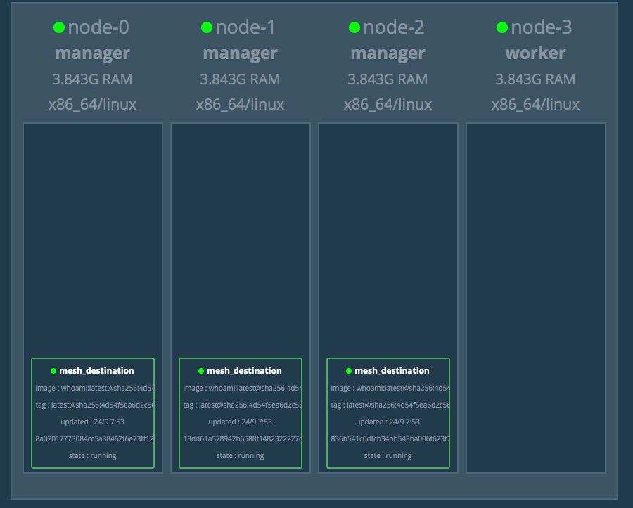

# Docker Fundamentals Study Guide 2020

## Table of Contents

- [Docker Fundamentals Study Guide 2020](#docker-fundamentals-study-guide-2020)
  - [Table of Contents](#table-of-contents)
  - [1 Running & Inspecting Containers](#1-running--inspecting-containers)
    - [1.1 Start a container](#11-start-a-container)
    - [1.2 List containers in multiple ways](#12-list-containers-in-multiple-ways)
    - [1.3 Query the docker command line help](#13-query-the-docker-command-line-help)
    - [1.4 Remove containers](#14-remove-containers)
  - [2 Interactive Containers](#2-interactive-containers)
    - [2.1 Writing to Containers](#21-writing-to-containers)
    - [2.2 Reconnecting to Containers](#22-reconnecting-to-containers)
    - [2.3 List containers using more options and filters](#23-list-containers-using-more-options-and-filters)
  - [3 Detached Containers and Logging](#3-detached-containers-and-logging)
    - [3.1 Running a Container in the Background](#31-running-a-container-in-the-background)
    - [3.2 Attaching to Container Output](#32-attaching-to-container-output)
    - [3.3 Using Logging Options](#33-using-logging-options)
  - [4 Starting, Stopping, Inspecting and Deleting Containers](#4-starting-stopping-inspecting-and-deleting-containers)
    - [4.1 Starting and Restarting Containers](#41-starting-and-restarting-containers)
    - [4.2 Inspecting a Container](#42-inspecting-a-container)
    - [4.3 Deleting Containers](#43-deleting-containers)
  - [5 Interactive Image Creation](#5-interactive-image-creation)
    - [5.1 Modifying a Container](#51-modifying-a-container)
    - [5.2 Capturing Container State as an Image](#52-capturing-container-state-as-an-image)
    - [5.3 Further Reading](#53-further-reading)
  - [6 Creating Images with Dockerfiles (1/2)](#6-creating-images-with-dockerfiles-12)
    - [6.1 Writing and Building a Dockerfile](#61-writing-and-building-a-dockerfile)
    - [6.2 Using the Build Cache](#62-using-the-build-cache)
    - [6.3 Using the history Command](#63-using-the-history-command)
  - [7 Creating Images with Dockerfiles (2/2)](#7-creating-images-with-dockerfiles-22)
    - [7.1 Setting Default Commands](#71-setting-default-commands)
    - [7.2 Combining Default Commands and Options](#72-combining-default-commands-and-options)
  - [8 Multi-Stage Builds](#8-multi-stage-builds)
    - [8.1 Defining a multi-stage build](#81-defining-a-multi-stage-build)
    - [8.2 Building Intermediate Images](#82-building-intermediate-images)
    - [8.3 Optional: Building from Scratch](#83-optional-building-from-scratch)
    - [8.4 Optional: Enabling BuildKit](#84-optional-enabling-buildkit)
  - [9 Managing Images](#9-managing-images)
    - [9.1 Making an Account on Docker’s Hosted Registry](#91-making-an-account-on-dockers-hosted-registry)
    - [9.2 Tagging and Listing Images](#92-tagging-and-listing-images)
    - [9.3 Sharing Images on Docker Hub](#93-sharing-images-on-docker-hub)
    - [9.4 Further Reading](#94-further-reading)
  - [10 Database Volumes](#10-database-volumes)
    - [10.1 Launching Postgres](#101-launching-postgres)
    - [10.2 Writing to the Database](#102-writing-to-the-database)
    - [10.3 Further Reading](#103-further-reading)
  - [11 Introduction to Container Networking](#11-introduction-to-container-networking)
    - [11.1 Inspecting the Default Bridge](#111-inspecting-the-default-bridge)
    - [11.2 Connecting Containers to docker0](#112-connecting-containers-to-docker0)
    - [11.3 Defining Additional Bridge Networks](#113-defining-additional-bridge-networks)
  - [12 Container Port Mapping](#12-container-port-mapping)
    - [12.1 Port Mapping at Runtime](#121-port-mapping-at-runtime)
    - [12.2 Exposing Ports from the Dockerfile](#122-exposing-ports-from-the-dockerfile)
    - [12.3 Further Reading](#123-further-reading)
  - [13 Creating a Swarm](#13-creating-a-swarm)
    - [13.1 Starting Swarm](#131-starting-swarm)
    - [13.2 Adding Workers to the Swarm](#132-adding-workers-to-the-swarm)
    - [13.3 Promoting Workers to Managers](#133-promoting-workers-to-managers)
  - [14 Starting a Service](#14-starting-a-service)
    - [14.1 Creating an Overlay Network and Service](#141-creating-an-overlay-network-and-service)
    - [14.2 Inspecting Service Logs](#142-inspecting-service-logs)
    - [14.3 Cleanup](#143-cleanup)
  - [15 Node Failure Recovery](#15-node-failure-recovery)
    - [15.1 Setting up a Service](#151-setting-up-a-service)
    - [15.2 Simulating Node Failure](#152-simulating-node-failure)
    - [15.3 Force Rebalancing](#153-force-rebalancing)
    - [15.4 Cleanup](#154-cleanup)
  - [16 Swarm Scheduling](#16-swarm-scheduling)
    - [16.1 Restricting Resource Consumption](#161-restricting-resource-consumption)
    - [16.2 Configuring Global Scheduling](#162-configuring-global-scheduling)
    - [16.3 Scheduling via Node Constraints](#163-scheduling-via-node-constraints)
    - [16.4 Scheduling Topology-Aware Services](#164-scheduling-topology-aware-services)
  - [17 Provisioning Swarm Configuration](#17-provisioning-swarm-configuration)
    - [17.1 Creating a Stack](#171-creating-a-stack)
    - [17.2 Defining and Using .env Files](#172-defining-and-using-env-files)
    - [17.3 Defining and Using Docker Configs](#173-defining-and-using-docker-configs)
    - [17.4 Defining and Using Docker Secrets](#174-defining-and-using-docker-secrets)
  - [18 Routing to Services](#18-routing-to-services)
    - [18.1 Routing Cluster-Internal Traffic](#181-routing-cluster-internal-traffic)
    - [18.2 Routing Cluster-External Traffic](#182-routing-cluster-external-traffic)
  - [19 Updating Applications](#19-updating-applications)
    - [19.1 Deploying Dockercoins](#191-deploying-dockercoins)
    - [19.2 Scaling Up an Application](#192-scaling-up-an-application)
    - [19.3 Creating Rolling Updates](#193-creating-rolling-updates)
    - [19.4 Parallelizing Updates](#194-parallelizing-updates)
    - [19.5 Auto-Rollback Failed Updates](#195-auto-rollback-failed-updates)
  - [20 Installing Kubernetes](#20-installing-kubernetes)
    - [20.1 Initializing Kubernetes](#201-initializing-kubernetes)
  - [21 Kubernetes Orchestration](#21-kubernetes-orchestration)
    - [21.1 Creating Pods](#211-creating-pods)
    - [21.2 Creating ReplicaSets](#212-creating-replicasets)
    - [21.3 Creating Deployments](#213-creating-deployments)
  - [22 Provisioning Kube Configuration](#22-provisioning-kube-configuration)
    - [22.1 Provisioning ConfigMaps](#221-provisioning-configmaps)
    - [22.2 Provisioning Secrets](#222-provisioning-secrets)
  - [23 Kubernetes Networking](#23-kubernetes-networking)
    - [23.1 Routing Traffic with Calico](#231-routing-traffic-with-calico)
    - [23.2 Routing and Load Balancing with Services](#232-routing-and-load-balancing-with-services)
    - [23.3 Optional: Deploying DockerCoins onto the Kubernetes Cluster](#233-optional-deploying-dockercoins-onto-the-kubernetes-cluster)
  - [24 Cleaning up Docker Resources](#24-cleaning-up-docker-resources)
  - [25 Inspection Commands](#25-inspection-commands)
    - [25.1 Inspecting System Information](#251-inspecting-system-information)
    - [25.2 Monitoring System Events](#252-monitoring-system-events)
  - [26 Plugins](#26-plugins)
    - [26.1 Installing a Plugin](#261-installing-a-plugin)
    - [26.2 Enabling and Disabling a Plugin](#262-enabling-and-disabling-a-plugin)
    - [26.3 Inspecting a Plugin](#263-inspecting-a-plugin)
    - [Using the Plugin](#using-the-plugin)
    - [26.5 Removing a Plugin](#265-removing-a-plugin)
  - [27 Starting a Compose App](#27-starting-a-compose-app)
    - [27.1 Inspecting a Compose App](#271-inspecting-a-compose-app)
    - [27.2 Starting the App](#272-starting-the-app)
    - [27.3 Viewing Logs](#273-viewing-logs)
  - [28 Scaling a Compose App](#28-scaling-a-compose-app)
    - [28.1 Scaling a Service](#281-scaling-a-service)
    - [28.2 Investigating Bottlenecks](#282-investigating-bottlenecks)

## 1 Running & Inspecting Containers

- [Docker in 100 Seconds](https://www.youtube.com/watch?v=Gjnup-PuquQ)
- Update docker

```console
sudo yum install https://storebits.docker.com/ee/centos/sub-2df29a12-742a-461b-893c-9c1aca7aa714/7/x86_64/stable-19.03/Packages/docker-ee-19.03.12-3.el7.x86_64.rpm https://storebits.docker.com/ee/centos/sub-2df29a12-742a-461b-893c-9c1aca7aa714/7/x86_64/stable-19.03/Packages/containerd.io-1.3.4-3.1.el7.x86_64.rpm https://storebits.docker.com/ee/centos/sub-2df29a12-742a-461b-893c-9c1aca7aa714/7/x86_64/stable-19.03/Packages/docker-ee-cli-19.03.12-3.el7.x86_64.rpm
```

### 1.1 Start a container

- detached mode: run as a background process
- [linux system commands](https://centoshelp.org/resources/commands/linux-system-commands/)

```console
docker container run centos:7 ping 8.8.8.8
docker container run --detach centos:7 ping 8.8.4.4
docker container run --detach --name opendnsping \
  centos:7 ping 208.67.222.222
docker container run --detach --name pinggoogledns centos:7 ping 8.8.8.8
```

**[⬆ back to top](#table-of-contents)**

### 1.2 List containers in multiple ways

- quiet option: only display numeric IDs

```console
docker ps
docker container ls
docker container ls -a
docker container ls --all
docker container ls --all --quiet
```

**[⬆ back to top](#table-of-contents)**

### 1.3 Query the docker command line help

```console
docker container rm --help
docker container ls --help
```

**[⬆ back to top](#table-of-contents)**

### 1.4 Remove containers

```console
docker container rm <container ID>
docker container rm --force <container ID>
docker container rm --force $(docker container ls --all --quiet)
```

**[⬆ back to top](#table-of-contents)**

## 2 Interactive Containers

### 2.1 Writing to Containers

Container lifecycle

- run: container is in CREATED state
- start: container is in UP state
- stop: container is in EXITED state

```console
docker container run -it centos:7 bash
[root@2b8de2ffdf85 /]# ls -l
[root@2b8de2ffdf85 /]# echo 'Hello there...' > test.txt 
[root@2b8de2ffdf85 /]# ls -l | grep.test.txt
```

**[⬆ back to top](#table-of-contents)**

### 2.2 Reconnecting to Containers

- docker exec: Run a command in a running container
- docker top: Display the running processes of a container
- linux ps: Prints a list of currently running processes

```console
docker container ls -a
docker container start <container ID> 
docker container ls
docker container exec <container ID> ps -ef
docker container top <container ID>
docker container exec -it <container ID> bash
```

**[⬆ back to top](#table-of-contents)**

### 2.3 List containers using more options and filters

- no-trunc option: see the entire container ID
- q: List only the container ID
- l: List the last container created
- filter: filter results

```console
docker container ls -a --no-trunc
docker container ls -a -q
docker container ls -l
docker container ls -a --filter "exited=0"
docker container rm -f $(docker container ls -aq)
```

**[⬆ back to top](#table-of-contents)**

## 3 Detached Containers and Logging

### 3.1 Running a Container in the Background

- detached mode: run as a background process

```console
docker container run centos:7 ping 127.0.0.1 -c 2
docker container run -d centos:7 ping 127.0.0.1
docker container logs <container ID>
```

**[⬆ back to top](#table-of-contents)**

### 3.2 Attaching to Container Output

- attach mode: attach a terminal to a container’s PID 1 output

```console
docker container attach <container ID>
docker container run -d -it centos:7 ping 127.0.0.1
```

**[⬆ back to top](#table-of-contents)**

### 3.3 Using Logging Options

- tail: display to the last n lines
- f: piped in real time to the terminal

```console
docker container logs --tail 5 <container ID>
docker container logs -f <container ID>
```

**[⬆ back to top](#table-of-contents)**

## 4 Starting, Stopping, Inspecting and Deleting Containers

### 4.1 Starting and Restarting Containers

docker container run -d centos:7 ping 8.8.8.8
docker container ls -l
docker container stop <container ID>
docker container ls -a -l
docker container start -a <container ID>
docker container kill <container ID>

**[⬆ back to top](#table-of-contents)**

### 4.2 Inspecting a Container

docker container start <container ID>
docker container inspect <container ID>
docker container inspect <container ID> | grep IPAddress
docker container inspect <container ID> | grep Cmd
docker container inspect --format='{{.Config.Cmd}}' <container ID>
docker container inspect --format='{{json .Config}}' <container ID> | jq

**[⬆ back to top](#table-of-contents)**

### 4.3 Deleting Containers

```console
docker start $(docker container ls -aq)
docker container ls -a
docker container ls -a --filter status=exited
docker container rm <container ID>
docker container ls -a
docker container rm -f <container ID>
docker container rm -f $(docker container ls -aq)
```

**[⬆ back to top](#table-of-contents)**

## 5 Interactive Image Creation

### 5.1 Modifying a Container

```console
docker container run -it centos:7 bash
[root@dfe86ed42be9 /]# yum install -y which wget
[root@dfe86ed42be9 /]# exit
docker container ls -a
docker container diff <container ID>
```

**[⬆ back to top](#table-of-contents)**

### 5.2 Capturing Container State as an Image

```console
docker container commit <container ID> myapp:1.0
docker image ls | grep myapp
docker container run -it myapp:1.0 bash
[root@2ecb80c76853 /]# which wget
```

**[⬆ back to top](#table-of-contents)**

### 5.3 Further Reading

- [List of container commands](https://docs.docker.com/engine/reference/commandline/container/)
- [Getting started with containers](https://docs.docker.com/get-started/part2/)
- [Start containers automatically](https://docs.docker.com/config/containers/start-containers-automatically/)
- [Limit a container's resources](https://docs.docker.com/config/containers/resource_constraints/)
- [Keep containers alive during daemon downtime](https://docs.docker.com/config/containers/live-restore/)
- [Isolate containers with a user namespace](https://docs.docker.com/engine/security/userns-remap/)
- [Intro to Windows Containers](https://www.docker.com/products/windows-containers)

**[⬆ back to top](#table-of-contents)**

## 6 Creating Images with Dockerfiles (1/2)

[Dockerfile reference](https://docs.docker.com/engine/reference/builder/)

### 6.1 Writing and Building a Dockerfile

- RUN executes command(s) in a new layer and creates a new image. E.g., it is often used for installing software packages.

Dockerfile

```
FROM centos:7

RUN yum update -y
RUN yum install -y wget
```

```console
docker image build -t myimage .
docker container run -it myimage bash
[root@1d86d4093cce /]# wget example.com
[root@1d86d4093cce /]# cat index.html
[root@1d86d4093cce /]# exit
cat Dockerfile | docker image build -t myimage -f - .
```

**[⬆ back to top](#table-of-contents)**

### 6.2 Using the Build Cache

Dockerfile

```
FROM centos:7

RUN yum update -y
RUN yum install -y wget 
RUN yum install -y vim
```

```console
docker image build -t myimage .
```

Dockerfile

```
FROM centos:7

RUN yum update -y
RUN yum install -y vim 
RUN yum install -y wget
```

```console
docker image build -t myimage .
```

**[⬆ back to top](#table-of-contents)**

### 6.3 Using the history Command

```console
docker image history myimage:latest
docker image build -t myimage .
docker image history myimage:latest
```

```
IMAGE               CREATED             CREATED BY                                      SIZE                COMMENT
e2429c9d83b3        36 hours ago        /bin/sh -c yum install -y wget                  92.2MB              
610de53a1d62        36 hours ago        /bin/sh -c yum install -y vim                   147MB               
8ed3e38b320f        37 hours ago        /bin/sh -c yum update -y                        91.5MB              
7e6257c9f8d8        6 weeks ago         /bin/sh -c #(nop)  CMD ["/bin/bash"]            0B                  
<missing>           6 weeks ago         /bin/sh -c #(nop)  LABEL org.label-schema.sc…   0B                  
<missing>           6 weeks ago         /bin/sh -c #(nop) ADD file:61908381d3142ffba…   203MB
```

Dockerfile

```
FROM centos:7

RUN yum update -y
RUN yum install -y wget vim
```

```console
docker image build -t myimage .
```

**[⬆ back to top](#table-of-contents)**

## 7 Creating Images with Dockerfiles (2/2)

### 7.1 Setting Default Commands

- CMD sets default command and/or parameters, which can be overwritten from command line when docker container runs.
- ENTRYPOINT configures a container that will run as an executable.

Dockerfile

```
FROM centos:7

RUN yum update -y
RUN yum install -y wget vim
CMD ["ping", "127.0.0.1", "-c", "5"]
```

```console
docker image build -t myimage .
docker container run myimage
docker container run myimage echo "hello world"
```

Dockerfile

```
FROM centos:7

RUN yum update -y
RUN yum install -y wget vim
ENTRYPOINT ["ping"]
```

```console
docker image build -t myimage .
docker container run myimage
docker container run myimage 127.0.0.1
```

**[⬆ back to top](#table-of-contents)**

### 7.2 Combining Default Commands and Options

Dockerfile

```
FROM centos:7

RUN yum update -y
RUN yum install -y wget vim
ENTRYPOINT ["ping", "-c", "3"]
CMD ["127.0.0.1"]
```

```console
docker image build -t myimage .
docker container run myimage
docker container run myimage 8.8.8.8
```

**[⬆ back to top](#table-of-contents)**

## 8 Multi-Stage Builds

### 8.1 Defining a multi-stage build

Dockerfile

```
FROM alpine:3.5 
RUN apk update && \
  apk add --update alpine-sdk
RUN mkdir /app
WORKDIR /app
COPY hello.c /app
RUN mkdir bin
RUN gcc -Wall hello.c -o bin/hello
CMD /app/bin/hello
```

```console
docker image build -t my-app-large .
docker image ls | grep my-app-large
docker container run my-app-large
```

Dockerfile

```
FROM alpine:3.5 AS build 
RUN apk update && \
  apk add --update alpine-sdk
RUN mkdir /app
WORKDIR /app
COPY hello.c /app
RUN mkdir bin
RUN gcc -Wall hello.c -o bin/hello

FROM alpine:3.5
COPY --from=build /app/bin/hello /app/hello
CMD /app/hello
```

```console
docker image build -t my-app-small .
docker image ls | grep 'my-app-'
docker container run --rm my-app-small
```

**[⬆ back to top](#table-of-contents)**

### 8.2 Building Intermediate Images

```console
docker image build -t my-build-stage --target build .
docker image ls | grep 'my-build-stage'
docker container run -it --rm my-build-stage /app/bin/hello
```

```console
docker image history my-app-large:latest
docker image history my-app-small:latest
docker image history my-build-stage:latest
```

my-app-large:latest

```console
5584686e4f85        12 minutes ago      /bin/sh -c #(nop)  CMD ["/bin/sh" "-c" "/app…   0B                  
31a78f507531        12 minutes ago      /bin/sh -c gcc -Wall hello.c -o bin/hello       10.6kB              
5b2111e5495b        12 minutes ago      /bin/sh -c mkdir bin                            0B                  
4faff63a12e7        12 minutes ago      /bin/sh -c #(nop) COPY file:1a97681366e8c1df…   81B                 
6a1e3d0606e6        12 minutes ago      /bin/sh -c #(nop) WORKDIR /app                  0B                  
d3cc5ab9096e        12 minutes ago      /bin/sh -c mkdir /app                           0B                  
200fda09a157        12 minutes ago      /bin/sh -c apk update &&   apk add --update …   180MB               
f80194ae2e0c        20 months ago       /bin/sh -c #(nop)  CMD ["/bin/sh"]              0B                  
<missing>           20 months ago       /bin/sh -c #(nop) ADD file:84d23bb1bfe03587c…   4MB 
```

my-app-small:latest

```console
6246fee1a37a        7 minutes ago       /bin/sh -c #(nop)  CMD ["/bin/sh" "-c" "/app…   0B                  
b635ee179c22        7 minutes ago       /bin/sh -c #(nop) COPY file:e1bb5e4622dbf3b5…   10.6kB              
f80194ae2e0c        20 months ago       /bin/sh -c #(nop)  CMD ["/bin/sh"]              0B                  
<missing>           20 months ago       /bin/sh -c #(nop) ADD file:84d23bb1bfe03587c…   4MB   
```

my-build-stage:latest

```console
31a78f507531        16 minutes ago      /bin/sh -c gcc -Wall hello.c -o bin/hello       10.6kB              
5b2111e5495b        16 minutes ago      /bin/sh -c mkdir bin                            0B                  
4faff63a12e7        16 minutes ago      /bin/sh -c #(nop) COPY file:1a97681366e8c1df…   81B                 
6a1e3d0606e6        16 minutes ago      /bin/sh -c #(nop) WORKDIR /app                  0B                  
d3cc5ab9096e        16 minutes ago      /bin/sh -c mkdir /app                           0B                  
200fda09a157        16 minutes ago      /bin/sh -c apk update &&   apk add --update …   180MB               
f80194ae2e0c        20 months ago       /bin/sh -c #(nop)  CMD ["/bin/sh"]              0B                  
<missing>           20 months ago       /bin/sh -c #(nop) ADD file:84d23bb1bfe03587c…   4MB   
```

**[⬆ back to top](#table-of-contents)**

### 8.3 Optional: Building from Scratch

[scratch](https://hub.docker.com/_/scratch)

Dockerfile

```
FROM alpine:3.8 AS build
RUN ["apk", "update"]
RUN ["apk", "add", "--update", "alpine-sdk"]
COPY sleep.c /
RUN ["gcc", "-static", "sleep.c", "-o", "sleep"]

FROM scratch
COPY --from=build /sleep /sleep
CMD ["/sleep"]
```

```console
docker image build -t sleep:scratch .
docker image history sleep:scratch
docker image ls | grep scratch
docker container run --name sleeper -d sleep:scratch
docker container top sleeper
sudo ls /proc/<PID>/root
docker container rm -f sleeper
```

```
IMAGE               CREATED             CREATED BY                                      SIZE                COMMENT
5fac24d124db        16 hours ago        /bin/sh -c #(nop)  CMD ["/sleep"]               0B                  
30098c0de8b3        16 hours ago        /bin/sh -c #(nop) COPY file:de95a23743d7d1df…   128kB
```

**[⬆ back to top](#table-of-contents)**

### 8.4 Optional: Enabling BuildKit

```
FROM alpine:3.8 AS build
RUN ["apk", "update"]
RUN ["apk", "add", "--update", "alpine-sdk"]
COPY sleep.c /
RUN ["gcc", "-static", "sleep.c", "-o", "sleep"]

FROM scratch
COPY --from=build /sleep /sleep
CMD ["/sleep"]

FROM alpine:3.5 AS prod
RUN apk update
COPY --from=build /app/bin/hello /app/hello 
CMD /app/hello
```

```console
export DOCKER_BUILDKIT=1
docker image build --no-cache -t my-app-small-bk .
export DOCKER_BUILDKIT=0
```

**[⬆ back to top](#table-of-contents)**

## 9 Managing Images

### 9.1 Making an Account on Docker’s Hosted Registry

[Docker Hub](https://hub.docker.com)

**[⬆ back to top](#table-of-contents)**

### 9.2 Tagging and Listing Images

```console
docker image pull centos:7
docker image tag centos:7 my-centos:dev
docker image ls -a | grep centos
```

**[⬆ back to top](#table-of-contents)**

### 9.3 Sharing Images on Docker Hub

```console
docker image push my-centos:dev
docker image tag my-centos:dev <Docker ID>/my-centos:dev
docker image push <Docker ID>/my-centos:dev
docker image build -t <Docker ID>/my-centos:1.0 .
docker image rm my-centos:dev
```

**[⬆ back to top](#table-of-contents)**

### 9.4 Further Reading

- [Best practices for writing Dockerfiles](https://docs.docker.com/develop/develop-images/dockerfile_best-practices/)
- [Use multi-stage builds](https://docs.docker.com/develop/develop-images/multistage-build/)
- [More about images, containers, and storage drivers](https://docs.docker.com/storage/storagedriver/)
- [Details on image layering](https://windsock.io/explaining-docker-image-ids/)
- [Graphdriver plugins](https://docs.docker.com/engine/extend/plugins_graphdriver/)
- [Docker Reference Architecture: An Intro to Storage Solutions for Docker CaaS](https://www.docker.com/sites/default/files/caaSwhitepaper_V6_0.pdf)
- [How to select a storage driver](https://docs.docker.com/storage/storagedriver/select-storage-driver/)
- [Use the AUFS storage driver](https://docs.docker.com/storage/storagedriver/aufs-driver/)
- [User guided caching in Docker](https://www.docker.com/blog/user-guided-caching-in-docker-for-mac/)

**[⬆ back to top](#table-of-contents)**

## 10 Database Volumes

### 10.1 Launching Postgres

```console
docker image pull postgres:9-alpine
docker image inspect postgres:9-alpine
docker container run --name some-postgres \
  -v db_backing:/var/lib/postgresql/data \
  -e POSTGRES_PASSWORD=password \
  -d postgres:9-alpine
```

**[⬆ back to top](#table-of-contents)**

### 10.2 Writing to the Database

```console
docker container exec -it some-postgres psql -U postgres
postgres=# CREATE TABLE PRODUCTS(PRICE FLOAT, NAME TEXT);
postgres=# INSERT INTO PRODUCTS VALUES('18.95', 'widget');
postgres=# INSERT INTO PRODUCTS VALUES('1.45', 'sprocket');
postgres=# SELECT * FROM PRODUCTS;
postgres=# \q
docker container rm -f some-postgres
docker container run \
  --name some-postgres \
  -v db_backing:/var/lib/postgresql/data \
  -e POSTGRES_PASSWORD=password \
  -d postgres:9-alpine
docker container exec -it some-postgres psql -U postgres
postgres=# SELECT * FROM PRODUCTS;
```

**[⬆ back to top](#table-of-contents)**

### 10.3 Further Reading

- [How to use volumes](https://docs.docker.com/storage/volumes/) 
- [Troubleshoot volume errors](https://docs.docker.com/storage/troubleshooting_volume_errors/)
- [Docker volume reference](https://docs.docker.com/engine/reference/commandline/volume_create/)

**[⬆ back to top](#table-of-contents)**

## 11 Introduction to Container Networking

[Networking features in Docker Desktop for Mac](https://docs.docker.com/docker-for-mac/networking/)

### 11.1 Inspecting the Default Bridge

```console
docker network ls
docker network inspect bridge
ip addr
sudo yum install bridge-utils
brctl show docker0
```

```
NETWORK ID          NAME                DRIVER              SCOPE
0d909ca6f3fa        bridge              bridge              local
8e90fc700e0f        host                host                local
6690bb85fa2c        none                null                local
```

**[⬆ back to top](#table-of-contents)**

### 11.2 Connecting Containers to docker0

```console
docker container run --name u1 -dt centos:7
docker network inspect bridge
ip addr
brctl show docker0
docker container exec -it u1 bash
[root@11da9b7db065 /]# yum install -y iproute
[root@11da9b7db065 /]# ip addr
```

**[⬆ back to top](#table-of-contents)**

### 11.3 Defining Additional Bridge Networks

- u1: 172.17.0.2

```console
docker network create --driver bridge my_bridge
docker container run --name=u2 --network=my_bridge -dt centos:7
docker container inspect u2
docker container run --name=u3 --network=my_bridge -it centos:7
[root@70bedd49293b /]# ping u2
docker container run centos:7 ping u1
docker network inspect bridge
docker container exec u2 ping <u1 IP>
docker container rm -f $(docker container ls -aq)
docker network rm my_bridge
```

**[⬆ back to top](#table-of-contents)**

## 12 Container Port Mapping

### 12.1 Port Mapping at Runtime

```console
docker container run -d nginx
docker container run -d -p 5000:80 nginx
docker container port <container id>
```

**[⬆ back to top](#table-of-contents)**

### 12.2 Exposing Ports from the Dockerfile

```console
docker image build -t my_nginx .
docker container run -d -P my_nginx
docker container ls -l
docker container rm -f $(docker container ls -aq)
```

**[⬆ back to top](#table-of-contents)**

### 12.3 Further Reading

- [Docker Reference Architecture: Designing Scalable, Portable Docker Container Networks](https://success.mirantis.com/article/networking)
- [Network containers](https://docs.docker.com/engine/tutorials/networkingcontainers/)
- [Docker container networking](https://docs.docker.com/network/)
- [Understand container communication](https://docs.docker.com/config/containers/container-networking/)

**[⬆ back to top](#table-of-contents)**

## 13 Creating a Swarm

Each node is one docker host. Each node can be a manager / work. A Manager coordinate the traffic between all workers.  A service is a image. A manager can involve a replica of a service in a worker node through a task.
All nodes communicate through the overlay private network.

### 13.1 Starting Swarm

- [Getting started with swarm mode](https://docs.docker.com/engine/swarm/swarm-tutorial/)
- [How nodes work](https://docs.docker.com/engine/swarm/how-swarm-mode-works/nodes/)
- [Orchestrating containers with Docker Swarm – Part 1](https://fabriciosanchez-en.azurewebsites.net/orchestrating-containers-with-docker-swarm-part-1/)
- [Orchestrating containers with Docker Swarm – Part 2](https://fabriciosanchez-en.azurewebsites.net/orchestrating-containers-with-docker-swarm-part-2/)
- [A Hands-On Guide to Container Orchestration With Docker Swarm](https://medium.com/better-programming/hands-on-guide-containers-orchestration-with-docker-swarm-27b3d64826c9)
- [Docker Swarm Visualizer](https://github.com/dockersamples/docker-swarm-visualizer)
- [Docker Swarm Reference Architecture: Exploring Scalable, Portable Docker Container Networks](https://success.mirantis.com/article/networking)

- A three-manager swarm tolerates a maximum loss of one manager.
- A five-manager swarm tolerates a maximum simultaneous loss of two manager nodes.
- An N manager cluster tolerates the loss of at most (N-1)/2 managers.
- Docker recommends a maximum of seven manager nodes for a swarm.

- TCP port 2377 for cluster management communications
- TCP and UDP port 7946 for communication among nodes
- UDP port 4789 for overlay network traffic

```console
docker swarm init
docker system info
docker node ls
docker swarm ca --rotate --cert-expiry 168h
sudo netstat -plunt | grep -E "2377|7946|4789"
```

```console
docker swarm leave -f
```

**[⬆ back to top](#table-of-contents)**

### 13.2 Adding Workers to the Swarm

```console
docker swarm join-token worker
```

**[⬆ back to top](#table-of-contents)**

### 13.3 Promoting Workers to Managers

```console
docker node promote node-1 node-2
docker run -it -d -p 5000:8080 -v /var/run/docker.sock:/var/run/docker.sock dockersamples/visualizer
```


**[⬆ back to top](#table-of-contents)**

## 14 Starting a Service

### 14.1 Creating an Overlay Network and Service

```console
docker network create --driver overlay my_overlay
docker network inspect my_overlay
docker service create --name pinger \
  --network my_overlay alpine ping 8.8.8.8
docker service ls
docker service ps pinger
docker service update pinger --replicas=3
docker network inspect my_overlay
```


**[⬆ back to top](#table-of-contents)**

### 14.2 Inspecting Service Logs

```console
docker service logs pinger
```

**[⬆ back to top](#table-of-contents)**

### 14.3 Cleanup

```console
docker service rm $(docker service ls -q)
```

**[⬆ back to top](#table-of-contents)**

## 15 Node Failure Recovery

### 15.1 Setting up a Service

```console
docker service create --replicas 4 --name myProxy nginx
docker service ps myProxy
```


```
ID                  NAME                IMAGE               NODE                DESIRED STATE       CURRENT STATE            ERROR               PORTS
ywsk4x9f0029        myProxy.1           nginx:latest        docker-desktop      Running             Running 27 seconds ago                       
mac3cltf1efr        myProxy.2           nginx:latest        docker-desktop      Running             Running 27 seconds ago                       
lodeq1bxbxwk        myProxy.3           nginx:latest        docker-desktop      Running             Running 27 seconds ago                       
izdjwq6ge3zj        myProxy.4           nginx:latest        docker-desktop      Running             Running 27 seconds ago
```

**[⬆ back to top](#table-of-contents)**

### 15.2 Simulating Node Failure

```console
[centos@node-3 ~]$ sudo reboot now
```

**[⬆ back to top](#table-of-contents)**

### 15.3 Force Rebalancing

```console
docker service update --force myProxy
```

**[⬆ back to top](#table-of-contents)**

### 15.4 Cleanup

```console
docker service rm $(docker service ls -q)
```

**[⬆ back to top](#table-of-contents)**

## 16 Swarm Scheduling

### 16.1 Restricting Resource Consumption

```console
docker service create --name compute-stress \
  --replicas 4 \
  --detach \
  training/stress:3.0 --vm 2
docker stats
docker service rm compute-stress
docker service create --name compute-stress \
  --replicas 4 \
  --limit-cpu 1 \
  --detach \
  training/stress:3.0 --vm 2
docker stats
docker service rm compute-stress
docker service create --name compute-stress \
  --replicas 4 \
  --limit-cpu 1 \
  --limit-memory 512M \
  --detach \
  training/stress:3.0 --vm 2 --vm-bytes 1024M
docker container ls -a
docker container inspect eac5f4c35142 | grep OOM
docker service rm compute-stress
docker service create --name compute-stress \
  --replicas 4 \
  --limit-cpu 1 \
  --limit-memory 512M \
  --reserve-memory 512M \
  --detach \
  training/stress:3.0 --vm 2 --vm-bytes 128M
docker service ps compute-stress
docker service update compute-stress --replicas=40 --detach
docker service ps compute-stress
docker inspect xf3xigecdfw8
docker service rm compute-stress
```

**[⬆ back to top](#table-of-contents)**

### 16.2 Configuring Global Scheduling

- Global services are generally only appropriate for things that perform or monitor things related directly to node management
- eg. Log shipping or monitoring agents

```
docker service create --mode global \
  --name my-global \
  centos:7 ping 8.8.8.8
docker service ps my-global
docker service rm my-global
```

**[⬆ back to top](#table-of-contents)**

### 16.3 Scheduling via Node Constraints

docker node update --label-add datacenter=east node-0
docker node update --label-add datacenter=east node-1
docker node update --label-add datacenter=west node-2
docker node update --label-add datacenter=west node-3
docker service create --replicas 4 \
  --constraint node.labels.datacenter==east \
  --name east-deploy \
  centos:7 ping 8.8.8.8
docker service rm east-deploy
docker service create --replicas 4 \
  --constraint node.role==worker \
  --name worker-only \
  centos:7 ping 8.8.8.8
docker service rm worker-only

**[⬆ back to top](#table-of-contents)**

### 16.4 Scheduling Topology-Aware Services

docker service create --name my_proxy \
  --replicas=2 --publish 8000:80 \
  --placement-pref spread=node.labels.datacenter \
  nginx
docker service ps my_proxy
docker service rm my_proxy

**[⬆ back to top](#table-of-contents)**

## 17 Provisioning Swarm Configuration

### 17.1 Creating a Stack

```console
docker stack deploy -c mystack.yaml dbdemo
docker stack ls
docker service ls
docker stack rm dbdemo
```

**[⬆ back to top](#table-of-contents)**

### 17.2 Defining and Using .env Files

```console
docker stack deploy -c mystack.yaml dbdemo
docker stack ps dbdemo
docker inspect <task ID> | grep ContainerID
docker container inspect <container ID> | grep POSTGRES
docker container exec -it <container ID> psql -U moby -d mydb
mydb=# \du
mydb=# \q
```

**[⬆ back to top](#table-of-contents)**

### 17.3 Defining and Using Docker Configs

```console
docker stack deploy -c mystack.yaml dbdemo
docker config ls
docker config inspect --pretty <config ID>
docker container exec -it <container ID> psql -U moby -d mydb
mydb=# \q
```

**[⬆ back to top](#table-of-contents)**

### 17.4 Defining and Using Docker Secrets

```console
docker secret create password ./mypassword
rm mypassword
docker secret inspect password
```

**[⬆ back to top](#table-of-contents)**

## 18 Routing to Services

### 18.1 Routing Cluster-Internal Traffic

Internal / Stateless

```console
nano net-demo.yaml
docker stack deploy -c net-demo.yaml netstack
docker stack ps netstack
[centos@node-3 ~]$ docker container ls
[centos@node-3 ~]$ docker container exec -it <container ID> bash
[root@0e3c8b8e8183 /]# curl destination:8000
I'm 00b4c2dc162b (node-1 container ID)
[root@0e3c8b8e8183 /]# curl destination:8000
I'm 6d23fb652e03 (node-2 container ID)
[root@0e3c8b8e8183 /]# curl destination:8000
I'm 8340c6f8fa4a (node-0 container ID)
[root@0e3c8b8e8183 /]# curl destination:8000
I'm 00b4c2dc162b (node-1 container ID)
[root@3047dbb47a7a /]# sudo yum install -y bind-utils
[root@3047dbb47a7a /]# nslookup destination
[root@3047dbb47a7a /]# exit
docker stack rm netstack
```


```
ID                  NAME                     IMAGE                    NODE                DESIRED STATE       CURRENT STATE            ERROR               PORTS
xz3g0dmv6waa        netstack_destination.1   training/whoami:latest   node-0              Running             Running 48 seconds ago                       
izhil4mrnwh0        netstack_origin.1        centos:7                 node-3              Running             Running 50 seconds ago                       
y0aiarrr7zyj        netstack_destination.2   training/whoami:latest   node-1              Running             Running 47 seconds ago                       
c1au2266t9wb        netstack_destination.3   training/whoami:latest   node-2              Running             Running 48 seconds ago
```

**[⬆ back to top](#table-of-contents)**

### 18.2 Routing Cluster-External Traffic

External / Stateless

```console
docker stack deploy -c mesh.yaml mesh
curl <any node IP>:8080
docker stack rm mesh
```



**[⬆ back to top](#table-of-contents)**

## 19 Updating Applications

### 19.1 Deploying Dockercoins

```console
git clone -b ee3.0 \
  https://github.com/docker-training/orchestration-workshop.git
cd ~/orchestration-workshop/dockercoins
docker stack deploy -c docker-compose.yml dockercoins
```


**[⬆ back to top](#table-of-contents)**

### 19.2 Scaling Up an Application

Modify docker-compose.yml

```
worker:
  image: training/dockercoins-worker:1.0 networks:
  - dockercoins
  deploy:
    replicas: 2
```

```console
docker stack deploy -c docker-compose.yml dockercoins
httping -c 5 localhost:8001
httping -c 5 localhost:8002
```

Modify docker-compose.yml

```
rng:
  image: training/dockercoins-rng:1.0 networks:
  - dockercoins
  ports:
  - "8001:80"
  deploy:
    mode: global
```

```console
docker stack rm dockercoins
docker stack deploy -c=docker-compose.yml dockercoins
```

**[⬆ back to top](#table-of-contents)**

### 19.3 Creating Rolling Updates

Modify worker.py

```
def work_once():
  log.debug("Doing one unit of work") time.sleep(0.1)
```

```console
docker image build -t <Docker ID>/dockercoins-worker:1.1 . 
docker image push <Docker ID>/dockercoins-worker:1.1
```

Modify docker-compose.yml

```
worker:
  image: <Docker ID>/dockercoins-worker:1.1
  networks:
  - dockercoins
```

```console
docker stack deploy -c='docker-compose.yml' dockercoins
```

**[⬆ back to top](#table-of-contents)**

### 19.4 Parallelizing Updates

Modify docker-compose.yml

```
worker:
  image: training/dockercoins-worker:1.0 networks:
  - dockercoins
  deploy:
    replicas: 10
    update_config:
    parallelism: 2
    delay: 5s
```

```console
docker stack deploy -c='docker-compose.yml' dockercoins
[centos@node-1 ~]$ watch -n1 "docker service ps dockercoins_worker \
  | grep -v Shutdown.*Shutdown"
```

**[⬆ back to top](#table-of-contents)**

### 19.5 Auto-Rollback Failed Updates

Modify docker-compose.yml

```
worker:
  image: training/dockercoins-worker:1.0 
  networks:
  - dockercoins
  deploy:
    replicas: 10
    update_config:
      parallelism: 2
      delay: 5s
      failure_action: rollback
      max_failure_ratio: 0.2
      monitor: 20s
```

```console
docker stack deploy -c=docker-compose.yml dockercoins
docker image build -t <Docker ID>/dockercoins-worker:bugged . 
docker image push <Docker ID>/dockercoins-worker:bugged
```

Modify docker-compose.yml

```
worker:
  image: training/dockercoins-worker:bugged
  networks:
  - dockercoins
  deploy:
    replicas: 10
    update_config:
      parallelism: 2
      delay: 5s
      failure_action: rollback
      max_failure_ratio: 0.2
      monitor: 20s
```

```console
docker stack rm dockercoins
```

**[⬆ back to top](#table-of-contents)**

## 20 Installing Kubernetes

- [The Illustrated Children’s Guide to Kubernetes](https://www.cncf.io/the-childrens-illustrated-guide-to-kubernetes/)
- [Kubernetes Explained in 100 Seconds](https://www.youtube.com/watch?v=PziYflu8cB8)

### 20.1 Initializing Kubernetes

```
sudo kubeadm init --pod-network-cidr=192.168.0.0/16 \
    --ignore-preflight-errors=SystemVerification
sudo kubeadm token create --print-join-command
mkdir -p $HOME/.kube
sudo cp -i /etc/kubernetes/admin.conf $HOME/.kube/config
sudo chown $(id -u):$(id -g) $HOME/.kube/config
kubectl get nodes
kubectl apply -f https://bit.ly/2KHCEgO
kubectl get nodes -w
[centos@node-1 ~]$ sudo kubeadm join ... --ignore-preflight-errors=SystemVerification
[centos@node-2 ~]$ sudo kubeadm join ... --ignore-preflight-errors=SystemVerification
kubectl get nodes
kubectl apply -f "https://cloud.weave.works/k8s/net?k8s-version=$(kubectl version | base64 | tr -d '\n')"
kubectl get pods -n kube-system
kubectl get po -A
```

**[⬆ back to top](#table-of-contents)**

## 21 Kubernetes Orchestration

[yaml files](https://gist.github.com/cm6051/5c7ee4eca0be4118195c8c34fae115e5)

### 21.1 Creating Pods

```console
kubectl create -f pod.yaml
kubectl get pod demo
kubectl describe pod demo
kubectl delete pod demo
kubectl create -f pod.yaml
kubectl exec -c=sidecar -it demo -- /bin/bash
[root@demo /]# curl localhost:80
[root@demo /]# ps -aux
[root@demo /]# ps -auwx
[root@demo /]# exit
kubectl delete pod demo
```

**[⬆ back to top](#table-of-contents)**

### 21.2 Creating ReplicaSets

```console
kubectl create -f replicaset.yaml
kubectl describe replicaset rs-demo
kubectl delete pod <pod name>
kubectl describe replicaset rs-demo
kubectl delete replicaset rs-demo
```

**[⬆ back to top](#table-of-contents)**

### 21.3 Creating Deployments

```console
nano deployment.yaml
less deployment.yaml
kubectl create -f deployment.yaml
kubectl describe deployment nginx-deployment
kubectl get replicaSet
kubectl set image deployment/nginx-deployment nginx=nginx:1.9.1
kubectl get replicaSets
kubectl delete deployment nginx-deployment
```

**[⬆ back to top](#table-of-contents)**

## 22 Provisioning Kube Configuration

### 22.1 Provisioning ConfigMaps

```console
kubectl create configmap dbconfig --from-env-file=env-config
kubectl get configmap dbconfig -o yaml
kubectl create -f postgres.yaml
kubectl describe pod dbdemo
kubectl exec -it -c pg dbdemo -- psql -U moby -d mydb
mydb=# \du
mydb=# \q
kubectl delete -f postgres.yaml
kubectl create configmap dbinit --from-file=db-init.sh
kubectl create -f postgres.yaml
kubectl exec -it -c pg dbdemo -- psql -U moby -d mydb
mydb=# SELECT * FROM products;
mydb=# \q
kubectl delete -f postgres.yaml
```

**[⬆ back to top](#table-of-contents)**

### 22.2 Provisioning Secrets

```console
kubectl create -f secret.yaml
kubectl create -f postgres.yaml
kubectl exec -it -c pg dbdemo -- env | grep POSTGRES
kubectl get secret postgres-pwd -o yaml
kubectl delete pod dbdemo
kubectl delete configmap dbconfig
kubectl delete configmap dbinit
kubectl delete secret postgres-pwd
```

## 23 Kubernetes Networking

### 23.1 Routing Traffic with Calico

```console
kubectl create -f deployment.yaml
kubectl get pods
kubectl describe pods <pod name>
ip route
curl <pod IP>:80
[centos@node-2 ~]$ ip route
kubectl logs <pod name>
```

**[⬆ back to top](#table-of-contents)**

### 23.2 Routing and Load Balancing with Services

```console
kubectl create -f cluster.yaml
kubectl get services
curl <nginx CLUSTER-IP>:8080
kubectl create -f nodeport.yaml
kubectl describe service nodeport-demo
kubectl delete deployment nginx-deployment
kubectl delete service cluster-demo
kubectl delete service nodeport-demo
```

**[⬆ back to top](#table-of-contents)**

### 23.3 Optional: Deploying DockerCoins onto the Kubernetes Cluster

```console
kubectl create deployment redis --image=redis

for DEPLOYMENT in hasher rng webui worker; do 
  kubectl create deployment $DEPLOYMENT \
    --image=training/dockercoins-${DEPLOYMENT}:1.0
done

kubectl get pods -o wide -w
kubectl logs deploy/rng
kubectl logs deploy/worker
kubectl get services
kubectl expose deployment redis --port 6379
kubectl expose deployment rng --port 80
kubectl expose deployment hasher --port 80
kubectl get services
kubectl logs deploy/worker
kubectl expose deploy/webui --type=NodePort --port 80
http://<node IP>:<port>
kubectl scale deploy/worker --replicas=10
kubectl get deploy/rng -o yaml --export > deploy-rng.yaml
kubectl apply -f deploy-rng.yaml
kubectl get daemonset
kubectl delete deploy/rng

for D in redis hasher rng webui; \
  do kubectl delete svc/$D; done

for D in redis hasher webui worker; \
  do kubectl delete deploy/$D; done

kubectl delete ds/rng
kubectl get all
```

**[⬆ back to top](#table-of-contents)**

## 24 Cleaning up Docker Resources

```console
docker system df
docker system prune
docker system df
docker container run --label apple --name fuji -d alpine
docker container run --label orange --name clementine -d alpine
docker container ls -a
docker container prune --filter 'label=apple'
docker container ls -a
TIMESTAMP=$(date --rfc-3339=seconds | sed 's/ /T/') 
docker container run --label tomato --name beefsteak -d alpine
docker container prune -f --filter "until=$TIMESTAMP"
docker container ls -a
```

**[⬆ back to top](#table-of-contents)**

## 25 Inspection Commands

### 25.1 Inspecting System Information

```console
docker system info
```

**[⬆ back to top](#table-of-contents)**

### 25.2 Monitoring System Events

```console
docker system events
<!-- Open a second connection -->
docker container run --rm alpine echo 'Hello World!'
docker system events --format '--> {{.Type}}-{{.Action}}'
docker system events --format '{{json .}}' | jq
```

**[⬆ back to top](#table-of-contents)**

## 26 Plugins

### 26.1 Installing a Plugin

```console
docker plugin install vieux/sshfs
docker plugin ls
```

```
Plugin "vieux/sshfs" is requesting the following privileges:
 - network: [host]
 - mount: [/var/lib/docker/plugins/]
 - mount: []
 - device: [/dev/fuse]
 - capabilities: [CAP_SYS_ADMIN]
```

**[⬆ back to top](#table-of-contents)**

### 26.2 Enabling and Disabling a Plugin

```console
docker plugin disable vieux/sshfs
docker plugin ls
docker plugin enable vieux/sshfs
docker plugin ls
```

**[⬆ back to top](#table-of-contents)**

### 26.3 Inspecting a Plugin

```console
docker plugin inspect vieux/sshfs
docker plugin disable vieux/sshfs
docker plugin set vieux/sshfs DEBUG=1
docker plugin enable vieux/sshfs
docker plugin inspect vieux/sshfs
```

**[⬆ back to top](#table-of-contents)**

### Using the Plugin

```console
[centos@node-1 ~]$ mkdir ~/demo
docker volume create -d vieux/sshfs \
  -o sshcmd=centos@34.242.133.108:/home/centos/demo \
  -o password=skills0921 \
  sshvolume

docker volume ls
docker container run --rm -it -v sshvolume:/data alpine sh
docker container exec -it a56cba756409 sh
/ # cd /data
/ # echo 'Hello from client!' > demo.txt / # ls -al
[centos@node-1 ~] cd demo
[centos@node-1 ~] ls
```

**[⬆ back to top](#table-of-contents)**

### 26.5 Removing a Plugin

```console
docker volume rm sshvolume
docker plugin disable vieux/sshfs
docker plugin rm vieux/sshfs
```

**[⬆ back to top](#table-of-contents)**

## 27 Starting a Compose App

[Compose file version 3 reference](https://docs.docker.com/compose/compose-file/)

```console
sudo curl -L "https://github.com/docker/compose/releases/download/1.27.3/docker-compose-$(uname -s)-$(uname -m)" -o /usr/local/bin/docker-compose
```

### 27.1 Inspecting a Compose App

```console
git clone -b ee3.0 \
    https://github.com/docker-training/orchestration-workshop.git
cd orchestration-workshop/dockercoins
```

**[⬆ back to top](#table-of-contents)**

### 27.2 Starting the App

```console
docker-compose up
docker-compose up -d
docker-compose ps
```

**[⬆ back to top](#table-of-contents)**

### 27.3 Viewing Logs

```console
docker-compose logs
docker-compose logs --tail 10 --follow
```

**[⬆ back to top](#table-of-contents)**

## 28 Scaling a Compose App

### 28.1 Scaling a Service

```console
docker-compose ps
docker-compose up -d --scale worker=2
docker-compose ps
```

**[⬆ back to top](#table-of-contents)**

### 28.2 Investigating Bottlenecks

```console
docker-compose up -d --scale worker=10
docker-compose ps
httping -c 5 localhost:8001
httping -c 5 localhost:8002
docker-compose down
```

**[⬆ back to top](#table-of-contents)**